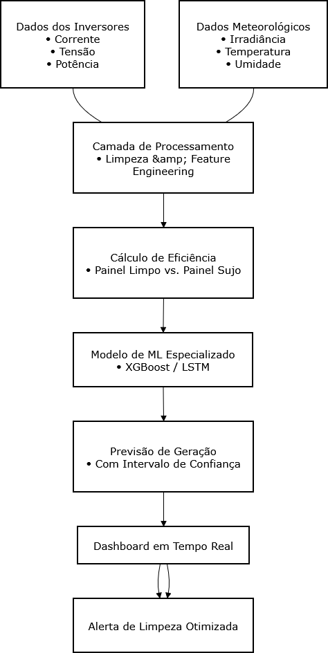

# Previsão de produção energética solar

### Previsão Inteligente de Geração Solar com Análise

### Fluxograma:

  

### Dados de entrada:
Os datasets se tratam da potência nos painéis solares fotovoltaicos presentes no terraço de um dos blocos do IFCE Campus Caucaia, por um período de 3 meses onde estes estavam sujeitos a sujeira como poeira e pequenos grãos de areia.

Um dos datasets possui os dados daqueles com um sistema de limpeza via ar comprimido feito por José Tarcizio, coordenador do curso técnico de eletroeletrônica, enquanto o outro possui dados daqueles que não estavam sujeitos a essa limpeza periódica.
* Os Datasets utilizados estarão disponíveis para consulta nesse repositório.

### Pipeline do projeto:
- Coleta dados de corrente, tensão, eficiência (painéis limpos vs. sujos) + dados meteorológicos;
- Processa e cria features específicas para isolamento do fator sujeira;
- Treina modelos de ML especializados em prever geração energética;
- Entrega previsões com intervalo de confiança para tomada de decisão.
